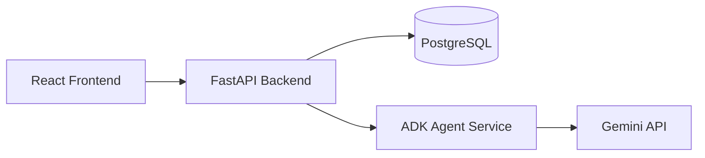

# Quality Assistance App

Monorepo for an AI-powered quality engineering assistant across the software test life cycle (STLC).

| Folder | Stack | Purpose |
|--------|-------|---------|
| `frontend/` | React + Vite + Yarn | Web UI for submitting requirements and viewing agent output |
| `backend/` | Python + FastAPI + uv | REST API, PostgreSQL persistence, orchestration |
| `agent/` | Python + Google ADK + uv | Gemini-powered quality assistance agent |

## Architecture



## Prerequisites

- Node.js 20+ and Yarn
- Python 3.11+
- [uv](https://docs.astral.sh/uv/) package manager
- Docker (for PostgreSQL)
- [Gemini API key](https://aistudio.google.com/app/apikey)

## Quick start

### Run everything (one command)

```bash
./scripts/dev.sh
```

This starts the agent, backend, and frontend. If PostgreSQL is already running locally (port from `backend/.env`), Docker is skipped. Otherwise it starts PostgreSQL via Docker. Press `Ctrl+C` to stop app services (and Docker Postgres only if the script started it).

### Manual setup

### 1. Open the workspace

```bash
code quality-assistance-app.code-workspace
```

### 2. Start PostgreSQL

```bash
docker compose up -d
```

### 3. Configure environment

```bash
cp .env.example backend/.env
cp agent/.env.example agent/.env
cp frontend/.env.example frontend/.env
```

Set `GOOGLE_API_KEY` in `agent/.env`.

### 4. Run the agent service (port 8001)

```bash
cd agent
uv sync
uv run quality-assistance-agent
```

Optional: use the ADK web UI for debugging (from `agent/agents`):

```bash
cd agent/agents
uv run adk web --port 8080
```

### 5. Run database migrations

```bash
cd backend
uv sync
uv run alembic upgrade head
```

Migrations run automatically when the backend starts. New migration files use date-based names, e.g. `20260517_021252_<rev>_initial_schema.py`.

**Create a new migration** (after model changes):

```bash
cd backend
uv run alembic revision --autogenerate -m "describe_change"
uv run alembic upgrade head
```

If upgrading from the old `create_all` schema, drop legacy tables first:

```sql
DROP TABLE IF EXISTS assistance_requests;
```

### 6. Run the backend (port 8000)

```bash
cd backend
uv run quality-assistance-backend
```

### 7. Run the frontend (port 5173)

```bash
cd frontend
yarn install
yarn dev
```

Open http://localhost:5173, **register** or **sign in**, then use the workspace to submit requirements.

### Auth API

| Endpoint | Description |
|----------|-------------|
| `POST /api/auth/register` | Create account |
| `POST /api/auth/login` | Sign in (returns JWT) |
| `GET /api/auth/me` | Current user (Bearer token) |

`POST /api/assist` requires authentication.

## API endpoints

| Service | Endpoint | Description |
|---------|----------|-------------|
| Backend | `GET /health` | Health check |
| Backend | `POST /api/assist` | Run quality assistance (persists to PostgreSQL) |
| Agent | `GET /health` | Health check |
| Agent | `POST /assist` | Invoke Google ADK agent directly |

## Project layout

```
quality-assistance-app/
├── frontend/          # React app (yarn)
├── backend/           # FastAPI API (uv)
├── agent/             # Google ADK agent (uv)
│   └── agents/quality_assistance/   # ADK CLI entrypoint
├── docker-compose.yml
├── quality-assistance-app.code-workspace
└── README.md
```

## Related project

The sibling `quality-assistant/` folder in this repo contains an earlier LangGraph-based prototype you can reference for STLC agent ideas.
