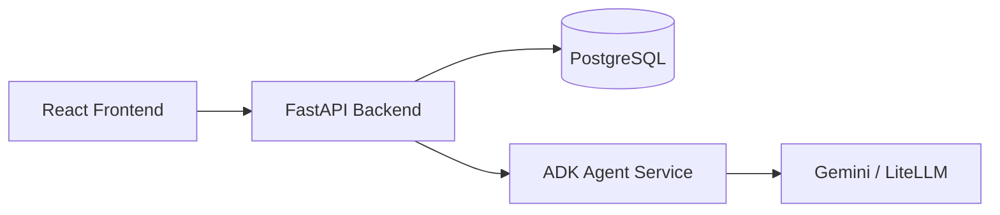

# Quality Assistance App

Monorepo for an AI-powered quality engineering assistant across the software test life cycle (STLC).

| Folder | Stack | Purpose |
|--------|-------|---------|
| `frontend/` | React + Vite + Yarn | Web UI for submitting requirements and viewing agent output |
| `backend/` | Python + FastAPI + uv | REST API, PostgreSQL persistence, orchestration |
| `agent/` | Python + Google ADK + uv | Multi-model quality assistance agent (Gemini / LiteLLM) |

## Architecture



## Platform setup guides

Detailed install and troubleshooting:

| Platform | Guide |
|----------|--------|
| **macOS** | [docs/SETUP-MAC.md](docs/SETUP-MAC.md) |
| **Windows** | [docs/SETUP-WINDOWS.md](docs/SETUP-WINDOWS.md) |

## Prerequisites (all platforms)

| Tool | Purpose |
|------|---------|
| **Node.js** 20+ & **Yarn** | Frontend |
| **Python** 3.11+ & **[uv](https://docs.astral.sh/uv/)** | Backend & agent |
| **PostgreSQL** 16+ | Database (users, assistance history) |
| **Docker Desktop** *or* local Postgres | Run Postgres on port **5432** |
| **Gemini API key** | [Google AI Studio](https://aistudio.google.com/app/apikey) (or OpenAI for LiteLLM) |

Full checklists: **[Windows](docs/SETUP-WINDOWS.md)** · **[macOS](docs/SETUP-MAC.md)**

## Quick start

### macOS / Linux

```bash
chmod +x scripts/dev.sh
./scripts/dev.sh
```

### Windows (PowerShell)

```powershell
Set-ExecutionPolicy -Scope Process -ExecutionPolicy Bypass
.\scripts\dev.ps1
```

Both scripts:

- Create `.env` files from examples if missing
- Use existing local Postgres on `5432`, or start Docker Postgres
- Install dependencies, run migrations, start all services

Press **Ctrl+C** to stop. Logs: `.logs/agent.log`, `.logs/backend.log`, `.logs/frontend.log`

## Run with Docker (full stack)

Runs **PostgreSQL**, **agent**, **backend**, and **frontend** in containers. You only need **Docker Desktop** and a **Gemini API key** (no local Node/Python/uv required for this mode).

### Prerequisites

| Tool | Purpose |
|------|---------|
| **Docker Desktop** | [macOS](https://docs.docker.com/desktop/setup/install/mac-install/) · [Windows](https://docs.docker.com/desktop/setup/install/windows-install/) |
| **Gemini API key** | [Google AI Studio](https://aistudio.google.com/app/apikey) |

Ensure Docker Desktop is **running** before you start.

### macOS / Linux

```bash
cd quality-assistance-app

cp .env.docker.example .env
# Edit .env and set GOOGLE_API_KEY=your-real-key

chmod +x scripts/docker-up.sh
./scripts/docker-up.sh
```

Or without the helper script:

```bash
docker compose up --build
```

### Windows (PowerShell)

```powershell
cd quality-assistance-app

Copy-Item .env.docker.example .env
# Edit .env and set GOOGLE_API_KEY=your-real-key

Set-ExecutionPolicy -Scope Process -ExecutionPolicy Bypass
.\scripts\docker-up.ps1
```

Or without the helper script:

```powershell
docker compose up --build
```

### After startup

| URL | Service |
|-----|---------|
| http://localhost:5173 | Web UI |
| http://localhost:8000/docs | Backend API |
| http://localhost:8001/docs | Agent API |

```bash
# macOS / Linux — follow logs
docker compose logs -f

# Stop everything
docker compose down
```

```powershell
# Windows — follow logs
docker compose logs -f

# Stop everything
docker compose down
```

**Note:** `dev.sh` / `dev.ps1` still use local Node/Python and only start **Postgres** via `docker compose up -d postgres` when needed. The full-stack Docker mode above runs all services in containers.

Platform details: **[macOS](docs/SETUP-MAC.md#run-full-stack-with-docker-compose)** · **[Windows](docs/SETUP-WINDOWS.md#run-full-stack-with-docker-compose)**

### First-time configuration

Copy env templates and set secrets (see platform guides for details):

```bash
# macOS / Linux / Git Bash
cp backend/.env.example backend/.env
cp agent/.env.example agent/.env
cp frontend/.env.example frontend/.env
```

```powershell
# Windows PowerShell
Copy-Item backend\.env.example backend\.env
Copy-Item agent\.env.example agent\.env
Copy-Item frontend\.env.example frontend\.env
```

**Required:**

- `agent/.env` → credentials for your backend: `GOOGLE_API_KEY` (gemini), `OPENAI_API_KEY` (litellm + OpenAI), AWS vars (bedrock), or Ollama (`AGENT_BACKEND=ollama`, no key — see [ollama.com](https://ollama.com))
- `backend/.env` → `JWT_SECRET`, `ENCRYPTION_KEY`

Generate Fernet key:

```bash
python -c "from cryptography.fernet import Fernet; print(Fernet.generate_key().decode())"
```

### Open the app

| URL | Service |
|-----|---------|
| http://localhost:5173 | Web UI — register, sign in, submit requirements |
| http://localhost:8000/docs | Backend API |
| http://localhost:8001/docs | Agent API |

## Services and ports

| Port | Service |
|------|---------|
| 5173 | Frontend (Vite) |
| 8000 | Backend (FastAPI) |
| 8001 | Agent (ADK) |
| 5432 | PostgreSQL |

## Manual run (separate terminals)

See [docs/SETUP-MAC.md](docs/SETUP-MAC.md) or [docs/SETUP-WINDOWS.md](docs/SETUP-WINDOWS.md).

**Agent** (port 8001):

```bash
cd agent && uv sync && uv run quality-assistance-agent
```

**Backend** (port 8000):

```bash
cd backend && uv sync && uv run alembic upgrade head && uv run quality-assistance-backend
```

**Frontend** (port 5173):

```bash
cd frontend && yarn install && yarn dev
```

**PostgreSQL only** (when not using the full Docker stack):

```bash
docker compose up -d postgres
```

## Auth API

| Endpoint | Description |
|----------|-------------|
| `POST /api/auth/register` | Create account |
| `POST /api/auth/login` | Sign in (returns JWT) |
| `GET /api/auth/me` | Current user (Bearer token) |

`POST /api/assist` requires authentication.

## API endpoints

| Service | Endpoint | Description |
|---------|----------|-------------|
| Backend | `GET /health` | Health check |
| Backend | `POST /api/assist` | Run quality assistance (persists to PostgreSQL) |
| Agent | `GET /health` | Health check |
| Agent | `POST /assist` | Invoke ADK agent directly |

## Model configuration

Default (Gemini) in `agent/.env`:

```env
AGENT_BACKEND=gemini
AGENT_MODEL=gemini-2.0-flash
GOOGLE_API_KEY=your-key
```

OpenAI via LiteLLM:

```env
AGENT_BACKEND=litellm
AGENT_MODEL=openai/gpt-4o-mini
OPENAI_API_KEY=your-key
```

Amazon Bedrock (the `bedrock/` prefix is added automatically):

```env
AGENT_BACKEND=bedrock
AGENT_MODEL=anthropic.claude-3-5-sonnet-20240620-v1:0
AWS_ACCESS_KEY_ID=your-aws-access-key-id
AWS_SECRET_ACCESS_KEY=your-aws-secret-access-key
AWS_REGION_NAME=us-east-1
```

> Make sure the chosen model is enabled under **Bedrock → Model access** in your AWS
> region. For temporary credentials (assumed roles / SSO) also set `AWS_SESSION_TOKEN`.

Ollama (local, free — no API key):

```env
AGENT_BACKEND=ollama
AGENT_MODEL=llama3.2
OLLAMA_API_BASE=http://localhost:11434
```

Install [Ollama](https://ollama.com), then pull the model:

```bash
ollama pull llama3.2
```

When running the agent in Docker, point at the host Ollama server:

```env
OLLAMA_API_BASE=http://host.docker.internal:11434
```

## Database migrations

Migrations run automatically when using `dev.sh` / `dev.ps1` and on backend startup.

```bash
cd backend
uv run alembic revision --autogenerate -m "describe_change"
uv run alembic upgrade head
```

## Project layout

```
quality-assistance-app/
├── frontend/              # React app (yarn)
├── backend/               # FastAPI API (uv)
├── agent/                 # Google ADK agent (uv)
│   └── agents/quality_assistance/   # ADK CLI entrypoint
├── scripts/
│   ├── dev.sh             # macOS / Linux / Git Bash (local dev)
│   ├── dev.ps1            # Windows PowerShell (local dev)
│   ├── docker-up.sh       # macOS / Linux — full stack in Docker
│   └── docker-up.ps1      # Windows — full stack in Docker
├── .env.docker.example    # Root env for docker compose
├── docs/
│   ├── SETUP-MAC.md
│   ├── SETUP-WINDOWS.md
│   └── quality-assistance-e2e-sequence.puml
├── docker-compose.yml
└── quality-assistance-app.code-workspace
```

## Related project

The sibling `quality-assistant/` folder in this repo contains an earlier LangGraph-based prototype you can reference for STLC agent ideas.
